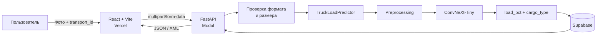
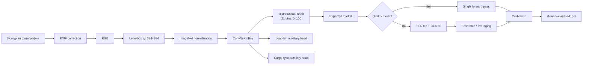

<h1 align="center">ГРУЗОМЕР</h1>

<p align="center">
  <strong>Computer Vision MVP для оценки заполнения грузового отсека по одной фотографии</strong><br/>
  Фото кузова → CV-модель → процент загрузки → сохранённый результат → XML/JSON API
</p>

<p align="center">
  <a href="https://roi-floor-roof-seg.vercel.app/"><strong>Live demo</strong></a>
  ·
  <a href="https://kirillpovasin--roi-floor-roof-api-api.modal.run/health"><strong>API health</strong></a>
  ·
  <a href="#как-работает-cv-пайплайн"><strong>CV pipeline</strong></a>
  ·
  <a href="#api"><strong>API</strong></a>
</p>

<p align="center">
  
  
  
  
  
  
  
</p>

---

<p align="center">
  
</p>

## Коротко о проекте

**ГРУЗОМЕР** автоматически оценивает, насколько заполнен грузовой отсек транспорта, по обычной фотографии. Пользователь передаёт снимок и номер перевозки, сервис запускает CV-инференс, возвращает процент загрузки от `0` до `100`, определяет тип груза и сохраняет результат для повторного получения через API.

Это не notebook-only эксперимент: проект доведён до полноценного MVP с **обученной CV-моделью, backend API, постоянным хранилищем, web-интерфейсом и production deployment**.

> **Важно:** модель оценивает визуальную заполненность кузова по размещённым объектам. Это не оценка массы груза и не расчёт использованной грузоподъёмности автомобиля.

## Результат

| Метрика / компонент | Результат |
|---|---:|
| Public leaderboard MAE | **5.5 п.п.** |
| Лучшая локальная OOF MAE | **6.4571 п.п.** |
| Доля OOF ошибок ≤ 10 п.п. | **77.5%** |
| Размеченная обучающая выборка | **716 фото** |
| Production backbone | **ConvNeXt-Tiny** |
| Production runtime | **1 CPU / 3 GB RAM** |
| Frontend | **Vercel** |
| Backend | **Modal + FastAPI** |
| Storage | **Supabase** |

`5.5` и `6.4571` получены на разных протоколах: первое значение относится к public leaderboard, второе к локальной OOF-проверке. Они специально не смешиваются в одну метрику.

## Что умеет MVP

| Возможность | Что происходит |
|---|---|
| Оценка загрузки | JPG / PNG / WEBP до 10 МБ → прогноз `0…100%` |
| Определение типа груза | auxiliary-head модели возвращает категорию груза |
| Привязка к перевозке | результат сохраняется по `transport_id` |
| Повторный поиск | результат можно получить по номеру перевозки |
| XML API | XML включается через `Accept: application/xml` |
| JSON API | используется web-интерфейсом и удобно для отладки |
| Обработка ошибок | отдельные ответы для неверного файла, отсутствующего результата и недоступной модели |
| Production deployment | frontend и backend развернуты отдельно и доступны по сети |

## Как работает система



Архитектура разделяет CV, API и UI. Модель можно заменить новым checkpoint без изменения контракта frontend и API.

## Как работает CV-пайплайн



### 1. Preprocessing

Перед инференсом изображение проходит:

- коррекцию ориентации по EXIF;
- преобразование в RGB;
- сохранение пропорций через `LongestMaxSize` + letterbox padding;
- приведение к `384×384`;
- ImageNet normalization.

Один и тот же preprocessing используется для локального инференса и production API.

### 2. ConvNeXt-Tiny

В production используется `ConvNeXt-Tiny` из `timm`. Backbone извлекает глобальный визуальный embedding, после чего несколько голов решают связанные задачи.

Основная голова делает **distributional regression**: модель предсказывает распределение вероятностей по 21 значению загрузки `0, 5, 10, …, 100`, после чего итоговый процент считается как математическое ожидание этого распределения.

Такой подход оказался устойчивее прямой регрессии одного числа и естественно ограничивает прогноз диапазоном `0…100`.

### 3. Multi-task learning

Во время обучения используются вспомогательные задачи:

- классификация диапазона загрузки;
- классификация типа груза.

Они заставляют backbone учить более содержательные визуальные признаки и работают как дополнительная регуляризация основной задачи.

Тип груза, который возвращает API, выбирается из категорий:

`blue_open_containers`, `pallets`, `blue_full_container`, `boxes`, `mixed`.

### 4. TTA и калибровка

Для режима максимального качества доступны:

- horizontal flip TTA;
- CLAHE-версия кадра;
- усреднение нескольких проходов / checkpoint-моделей;
- калибровка крайних значений к `0%` и `100%`.

В production TTA отключён намеренно: backend работает на CPU, поэтому выбран более быстрый single-pass режим. Это явный инженерный trade-off между latency и MAE.

## Качество модели

| OOF-вариант на 716 фото | MAE, п.п. | Ошибка ≤ 10 п.п. |
|---|---:|---:|
| Один проход ConvNeXt-Tiny | 6.6086 | 76.8% |
| Horizontal flip TTA | 6.5337 | 77.2% |
| TTA + threshold calibration | 6.4744 | 77.2% |
| TTA + affine calibration | **6.4571** | **77.5%** |

Для валидации использовался OOF-подход с учётом визуально похожих групп кадров, чтобы похожие изображения не оказывались одновременно в train и validation.

Это важно для такой задачи: обычный случайный split может завысить качество, если в датасете есть серии почти одинаковых фотографий одной и той же сцены.

## Web-интерфейс

Пользовательский сценарий максимально короткий:

1. указать номер перевозки;
2. загрузить фотографию кузова;
3. дождаться CV-инференса;
4. получить процент загрузки;
5. позже найти результат по `transport_id`.

<p align="center">
  
</p>

На скриншоте выше сервис вернул оценку загрузки, тип груза и использованную модель, после чего сохранил результат.

## API

### Endpoints

| Method | Endpoint | Назначение |
|---|---|---|
| `GET` | `/health` | health-check сервиса |
| `POST` | `/api/v1/predictions` | оценить фотографию и сохранить результат |
| `GET` | `/api/v1/predictions/{transport_id}` | получить сохранённую оценку |

### Создать прогноз

```bash
curl -X POST \
  "https://kirillpovasin--roi-floor-roof-api-api.modal.run/api/v1/predictions" \
  -H "Accept: application/xml" \
  -F "transport_id=TR-2026-001245" \
  -F "image=@truck.jpg"
```

Пример XML-ответа:

```xml
<?xml version="1.0" encoding="UTF-8"?>
<prediction>
  <transport_id>TR-2026-001245</transport_id>
  <load_pct>78.0</load_pct>
  <cargo_type>blue_full_container</cargo_type>
  <models_count>1</models_count>
  <backbone>convnext_tiny</backbone>
  <status>success</status>
  <method>cv_pipeline</method>
</prediction>
```

Без заголовка `Accept: application/xml` API возвращает эквивалентный JSON.

### Найти перевозку

```bash
curl \
  -H "Accept: application/xml" \
  "https://kirillpovasin--roi-floor-roof-api-api.modal.run/api/v1/predictions/TR-2026-001245"
```

## Tech stack

| Слой | Технологии |
|---|---|
| Computer Vision | Python, PyTorch, timm, ConvNeXt-Tiny, Albumentations, OpenCV |
| Training | 4-fold / OOF validation, multi-task learning, TTA, calibration |
| Backend | FastAPI, Uvicorn |
| Storage | Supabase |
| Frontend | React, Vite |
| Model delivery | Hugging Face model checkpoint |
| Backend deployment | Modal |
| Frontend deployment | Vercel |
| API formats | multipart/form-data, JSON, XML |

## Почему проект интересен с инженерной точки зрения

Это не только обучение нейросети. В одном проекте закрыт полный путь от данных до работающего продукта:

- сформулирована CV-задача и целевая метрика `MAE`;
- реализованы preprocessing, training и reproducible validation;
- проверены разные способы регрессии и постобработки;
- добавлены auxiliary задачи и TTA;
- написан production inference wrapper;
- модель подключена к FastAPI;
- результат сохраняется в Supabase;
- API умеет возвращать JSON и XML;
- сделан отдельный React frontend;
- frontend и backend независимо задеплоены;
- runtime оптимизирован под ограниченный CPU budget.

Именно этот end-to-end путь был целью проекта: не просто получить метрику, а превратить CV-модель в сервис, которым можно пользоваться.

## Эксперименты в репозитории

В репозитории также находятся экспериментальные ветки пайплайна: handcrafted CV-признаки, ROI/floor-related признаки и hybrid-модель, объединяющая CNN embedding с числовыми признаками.

Production inference при этом намеренно оставлен проще: deployed checkpoint использует `ConvNeXt-Tiny`, что уменьшает число зависимостей и делает backend предсказуемее в эксплуатации.

## Структура репозитория

```text
.
├── backend/                 # FastAPI API, validation, Supabase repository
├── frontend/                # React + Vite web interface
├── CV/
│   ├── mae5.5.ipynb         # основной training / validation experiment
│   └── src/
│       ├── predictor.py     # production inference wrapper
│       ├── CNN/             # ConvNeXt model and training components
│       └── manual/          # экспериментальные handcrafted / hybrid features
├── supabase/                # SQL / schema-related files
├── modal_app.py             # production deployment configuration
└── README.md
```

## Локальный запуск

<details>
<summary><strong>Backend</strong></summary>

### 1. Установить зависимости

```bash
pip install -r backend/requirements.txt
```

### 2. Задать environment variables

```bash
export CV_MODEL_PATH=/path/to/convnext_final.pt
export CV_DEVICE=cpu
export CV_USE_TTA=false
export CV_USE_CLAHE_TTA=false

export SUPABASE_URL=...
export SUPABASE_SECRET_KEY=...
```

### 3. Запустить API

```bash
uvicorn backend.app.main:app --reload --host 127.0.0.1 --port 8000
```

### 4. Проверить

```bash
curl http://127.0.0.1:8000/health
```

Ожидаемый ответ:

```json
{"status":"ok"}
```

</details>

<details>
<summary><strong>Frontend</strong></summary>

```bash
cd frontend
npm install
npm run dev
```

Для подключения к другому backend задайте `VITE_API_BASE_URL`.

</details>

## Ограничения

- модель обучалась на ограниченной выборке, поэтому перед реальным промышленным внедрением нужна повторная проверка на целевой камере и новых типах кузовов;
- метрика отражает визуальную заполненность, а не массу груза;
- production deployment работает на CPU и ради latency использует один checkpoint без TTA;
- перед большой нагрузкой нужен отдельный p50/p95 latency и RPS benchmark.

Эти ограничения оставлены явно: для CV-проекта важна не только лучшая метрика, но и понимание того, где модель может ошибаться.

## Команда

**VIRA**

- Кирилл Повасин
- Андрей Беляев

---

<p align="center">
  <strong>ГРУЗОМЕР</strong><br/>
  одна фотография → CV-прогноз → API → сохранённый результат
</p>
